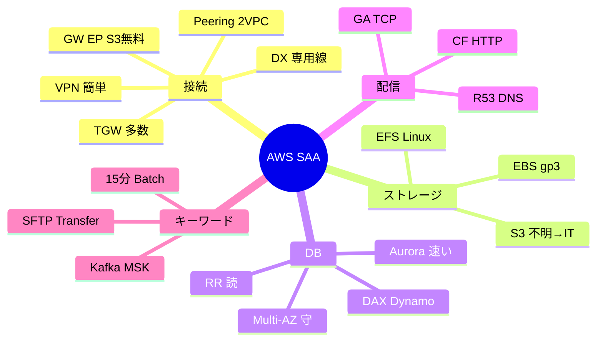

# AWS SAA メモリツリー（暗記用）

> 教科書の要約版。**上から順に枝を辿る**と答えに着く  
> 使い方：問題文のキーワードを見つける → 該当ツリーの ▼ を辿る

---

## 🌳 マスターツリー（最初に見る）

```
AWS SAA
├─【何を繋ぐ？】→ 接続ツリー §1
├─【何を保存？】→ ストレージツリー §2
├─【何のDB？】→ DBツリー §3
├─【どう配信・加速？】→ CDN/DNSツリー §4
├─【どう処理？】→ 計算・サーバーレス §5
├─【どう守る？】→ セキュリティ §6
├─【どう移す？】→ 移行 §7
└─【キーワードだけ？】→ 反射表 §8
```

---

## §1 接続ツリー「誰と誰をつなぐ？」

```
接続
│
├─ オンプレ ↔ AWS？
│   ├─ インターネット・早く・安く → Site-to-Site VPN（IPsec自動）
│   ├─ 専用線・安定・高速 → Direct Connect
│   ├─ 最強 → DX + VPN（専用線＋暗号化バックアップ）
│   └─ 個人PCだけ → Client VPN
│
├─ VPC ↔ VPC？
│   ├─ 2つだけ・シンプル → VPC Peering（※推移不可 A→C不可）
│   └─ 多数・ハブ型 → Transit Gateway（推移可）
│
├─ VPC ↔ AWSサービス（S3等）？
│   ├─ S3 or DynamoDB・無料 → Gateway Endpoint
│   ├─ その他サービス → Interface Endpoint（PrivateLink）
│   └─ オンプレからも使う → Interface（DX/VPN経由）
│
├─ 自社サービスを他社VPCに公開？
│   └─ PrivateLink + NLB
│
└─ 外部インターネットAPI（Google等）？
    └─ NAT Gateway（PrivateLinkでは不可）
```

### 暗記フレーズ
> **「オンプレVPN、専用線DX、VPCはPeeringかTGW、S3は無料GW」**

### SG vs NACL（接続の隣で必ず出る）

```
トラフィック制御
│
├─ 特定IPを拒否したい？
│   └─ YES → NACL（SGは拒否不可）
│
├─ インスタンス単位？
│   └─ YES → セキュリティグループ（ステートフル・許可のみ）
│
├─ サブネット単位？
│   └─ YES → NACL（ステートレス・番号順・戻りも許可要）
│
└─ VPC全体・高度？
    └─ AWS Network Firewall
```

### IPv6だけ覚える

```
IPv6でプライベートから外へ出すだけ
└─ Egress-Only Internet Gateway（NATのIPv6版）
```

---

## §2 ストレージツリー「何を・どう保存？」

### 2-1 まず3分類

```
ストレージ種類
├─ オブジェクト・静的・安い大容量 → S3
├─ ブロック・1台のディスク → EBS
└─ ファイル・共有
    ├─ Linux・複数EC2 → EFS（NFS）
    ├─ Windows・SMB → FSx for Windows
    └─ HPC・ML → FSx for Lustre
```

### 2-2 S3クラス（試験最頻出）

```
S3クラス選び
│
├─ ① 取り出しは即時？待てる？
│   ├─ 即時必須 → 次へ
│   └─ 数分〜12時間待てる → Glacier系へ
│
├─ ② アクセス頻度は？
│   ├─ 高い → Standard
│   ├─ 低い（月1回くらい）→ Standard-IA（最小30日）
│   ├─ 超低い（四半期1回）・即時 → Glacier Instant（最小90日）
│   └─ わからない → Intelligent-Tiering ★
│
├─ ③ 取得料金を払いたくない？
│   └─ YES → Intelligent-Tiering（取得料無料）
│
├─ ④ 最安・ほぼ読まない？
│   └─ Glacier Deep Archive
│
└─ ⑤ コンプライアンス監査？
    └─ Standard-IA（定期アクセス＝頻度は自然と高い）
```

### S3暗記フレーズ
> **「不明はIT、月1はIA、年1即時はGI、最安はDeep」**

### 2-3 EBSタイプ

```
EBS
│
├─ 汎用・コスパ → gp3（gp2より安・IOPS独立）★デフォルト
├─ 超高IOPS・DB → io1 / io2
│   ├─ 最高耐久5ナイン → io2
│   └─ 複数EC2同時マウント → io1/io2のみ（同一AZ）
├─ 大容量ログ・スループット → st1（ブート不可）
└─ 最安・コールド → sc1（ブート不可）

トラップ：io3は存在しない
```

### 2-4 永続性

```
EC2のディスク
├─ 止めたら消えてOK・爆速 → インスタンスストア
└─ 残したい・OS・DB → EBS
```

### 2-5 転送高速化

```
転送を速く
├─ S3にアップロード → Transfer Acceleration
├─ S3からダウンロード → CloudFront
└─ EC2/ALBへ・固定IP → Global Accelerator
```

---

## §3 DBツリー「SQL？NoSQL？何の用途？」

### 3-1 最初の分岐

```
DB
│
├─ SQL？
│   ├─ YES
│   │   ├─ コスト重視 → RDS
│   │   ├─ 高性能・30秒FO → Aurora ★
│   │   └─ トラフィック不明 → Aurora Serverless
│   └─ NO（NoSQL）
│       ├─ Key-Value大規模 → DynamoDB
│       ├─ ドキュメント → DocumentDB
│       ├─ グラフ → Neptune
│       ├─ 時系列 → Timestream
│       └─ 台帳 → QLDB
```

### 3-2 RDSの2つ（超頻出ペア）

```
RDSの複製
├─ 可用性・障害時切替 → Multi-AZ（同期）
└─ 読み取りを速く → リードレプリカ（非同期）

暗記：「マルチは守る、レプリは読む」
```

### 3-3 キャッシュ

```
DBの前にキャッシュ
│
├─ DynamoDB・変更最小？
│   └─ DAX（μs・DynamoDB専用）
│
├─ RDS・セッション・ランキング？
│   └─ ElastiCache Redis
│
└─ シンプル・水平だけ？
    └─ Memcached
```

### 3-4 バックアップ

```
過去に戻す
│
├─ 35日以内・秒単位？
│   └─ PITR（DynamoDB/RDS/Aurora）
│
├─ 35日より前？
│   └─ 手動スナップショット（無制限保持）
│
└─ 複数サービスまとめて管理？
    └─ AWS Backup
```

### DynamoDBモード

```
DynamoDB
├─ トラフィック不明 → オンデマンド
└─ 安定・安く → プロビジョニング
```

---

## §4 CDN・DNS・加速ツリー

```
配信・名前解決・経路
│
├─ 名前解決・DNSルーティング？
│   └─ Route 53
│       ├─ 1つ返す → シンプル
│       ├─ 遅延最小 → レイテンシー
│       ├─ 地域 → Geolocation
│       ├─ 割合 → Weighted
│       └─ 障害切替 → フェイルオーバー
│
├─ HTTP・キャッシュ・静的・動画？
│   └─ CloudFront
│       └─ 国制限だけ → Geo Restriction（無料）
│
└─ TCP/UDP・固定IP・低遅延？
    ├─ ゲーム・VoIP・API → Global Accelerator
    └─ IoT・MQTT → Global Accelerator（キャッシュ不要）

暗記：「DNSはR53、HTTPはCF、TCPはGA」
```

### CloudFront vs Redis（2段キャッシュ）

```
ユーザー → CloudFront → アプリ → Redis → DB
           （世界中）          （VPC内・DB負荷）
```

### WAFまわり

```
セキュリティ追加
├─ 国制限だけ → CF Geo Restriction
├─ 国制限＋他ルール → WAF + Geo Match
├─ SQLi等 → WAF
└─ DDoS → CF + WAF + Shield
```

---

## §5 計算・サーバーレス・ストリーム

### 5-1 EC2購入

```
EC2の買い方
├─ 短期・不定期 → オンデマンド
├─ 1〜3年安定
│   ├─ EC2 → Savings Plans ★推奨
│   └─ RDS → リザーブドインスタンス
├─ 中断OK・最安 → スポット
└─ Fleetで中断最小 → capacity-optimized ★
```

### 5-2 ELB

```
ロードバランサ
├─ HTTP/HTTPS・パス振分 → ALB
├─ TCP/UDP・超低遅延 → NLB
└─ サードパーティ機器 → GLB
```

### 5-3 Lambda vs Batch

```
処理時間
├─ 15分以内・イベント駆動 → Lambda
└─ 15分超・重いバッチ → AWS Batch
    ├─ サーバーレスにしたい → Batch + Fargate
    └─ 自分でEC2管理 → Batch + EC2
```

### 5-4 API公開

```
Lambdaを外に公開
├─ Webhookだけ・安い → Lambda Function URL
└─ WAF/throttling/Cognito/複数Lambda → API Gateway
```

### 5-5 メッセージング

```
非同期連携
├─ 1対1・順番・キュー → SQS
├─ 1対多・即時 → SNS
└─ イベントバス・AWS連携 → EventBridge
```

### 5-6 ストリーム

```
リアルタイムデータ
│
├─ 既存Kafkaを移行？
│   └─ MSK（メッセージ1GB・保持無制限）
│
├─ AWSネイティブ・ミリ秒・再処理？
│   └─ Kinesis Data Streams
│
├─ S3等へ自動配送・コード不要？
│   └─ Kinesis Firehose
│
└─ 分析・集計・コード必要？
    └─ Apache Flink（Managed）
        └─ よくある構成：Firehose→保存、Flink→分析
```

### 5-7 コンテナ

```
コンテナ
├─ Kubernetes・マルチクラウド → EKS
│   ├─ PodにIAM → IRSA
│   └─ 複数Podで共有ストレージ → EFS
├─ AWSでシンプル → ECS
├─ サーバー不要 → Fargate
└─ イメージ置き場 → ECR
```

### 5-8 フロント

```
SPA・フロント
├─ 典型 → S3 + CloudFront + API GW + Lambda
└─ 簡単デプロイ → Amplify
```

### 5-9 デプロイ

```
リリース方法
├─ 一部だけ試す → Canary
├─ 丸ごと切替・戻しやすい → Blue/Green（高コスト）
├─ 少しずつ → Rolling
└─ 一気・リスク高 → All at once
```

---

## §6 セキュリティツリー

### 6-1 IAM

```
IAM
├─ 権限定義 → ポリシー
├─ 付与セット → ロール
└─ 一時的に借りる → AssumeRole（STS）
    ├─ AWS内 → AssumeRole
    ├─ Google等 → AssumeRoleWithWebIdentity
    └─ AD等 → AssumeRoleWithSAML

評価：Deny最優先 → SCP → リソース → Boundary →  identity → デフォルトDeny
暗記：「Denyが王様」
```

### 6-2 秘密情報

```
秘密・鍵
├─ 暗号化キー → KMS
├─ 自動ローテーション → Secrets Manager
└─ 設定値・安い → SSM Parameter Store
```

### 6-3 検知3兄弟

```
何を検知？
├─ 不正・異常行動 → GuardDuty（警備員）
├─ 脆弱性 → Inspector（検査員）
└─ S3の個人情報 → Macie（監査員）

暗記：「ガード・インスペ・マサイ」
```

---

## §7 移行・DRツリー

### 7-1 データ移行

```
データを移す
│
├─ SFTP/FTP/FTPS？ ★キーワード
│   └─ Transfer Family → S3/EFS
│
├─ ファイル定期同期？
│   └─ DataSync
│
├─ DB移行・レプリケーション？
│   └─ DMS
│
├─ ネット遅い・PB級？
│   └─ Snowball
│
├─ 常時ハイブリッド？
│   └─ Storage Gateway
│       └─ オンプレSMB→S3 は File Gateway
│
└─ Windows共有？
    ├─ オンプレ継続 → Storage Gateway
    └─ AWS上 → FSx for Windows
```

### 7-2 DR（コスト安→高）

```
災害復旧（RTO/RPOが良いほど高い）
Backup & Restore
  → Pilot Light
    → Warm Standby
      → Multi-Site

暗記：「バック→パイロ→ウォーム→マルチ」
```

---

## §8 反射表（キーワード→即答）

| 聞こえたら                   | 答え                    |
| ----------------------- | --------------------- |
| SFTP                    | Transfer Family       |
| 固定IP / UDP / IoT / MQTT | Global Accelerator    |
| キャッシュ / 静的 / SPA        | CloudFront            |
| DNS / 名前解決              | Route 53              |
| DynamoDB + 変更最小         | DAX                   |
| RDS + キャッシュ             | Redis                 |
| セッション / ランキング           | Redis                 |
| S3アップロード高速              | Transfer Acceleration |
| オンプレ + 安定               | Direct Connect        |
| オンプレ + 簡単               | VPN                   |
| 既存Kafka                 | MSK                   |
| 35日より前                  | 手動スナップショット            |
| コンプライアンス監査 + S3         | Standard-IA           |
| 中断リスク最小                 | capacity-optimized    |
| 15分超                    | AWS Batch             |
| Pod + IAM               | IRSA                  |
| Pod + 共有ディスク            | EFS                   |
| 不正検知                    | GuardDuty             |
| 脆弱性                     | Inspector             |
| S3個人情報                  | Macie                 |
| フロント簡単                  | Amplify               |
| ローテーション                 | Secrets Manager       |
| 設定値安い                   | SSM                   |
| Webhookだけ               | Function URL          |
| WAF / throttling        | API Gateway           |
| 可用性                     | Multi-AZ              |
| 読み取り速く                  | リードレプリカ               |
| 拒否したいIP                 | NACL                  |
| S3/DynamoDB無料接続         | Gateway Endpoint      |
| io3                     | 存在しない（罠）              |

---

## §9 混同ペア・1行暗記

| A | B | 一行 |
|---|---|------|
| Multi-AZ | RR | 守る / 読む |
| Secrets | SSM | 回す / 置く |
| SQS | SNS | 1対1 / 1対多 |
| VPN | DX | ネット / 専用線 |
| IOPS | スループット | 回数 / MB |
| CF | GA | HTTP / TCP |
| CF | Redis | エッジ / DB前 |
| Firehose | Flink | 運ぶ / 計算する |
| Kinesis | MSK | AWS / Kafka |
| DAX | Redis | Dynamo専 / 汎用 |
| GW EP | IF EP | 無料S3 / 有料広 |
| Peering | TGW | 2つ / 多数 |
| PITR | SS | 35日秒 / 無制限 |
| Lambda | Batch | 15分 / 無限 |
| Func URL | APIGW | 安単 / 高機能 |
| IA | GI Instant | 30日月1 / 90日年1 |
| 不明 | IA | IT / 低頻度 |

---

## §10 1日5分暗記ルーティン

```
月：接続ツリー §1 を声に出す
火：ストレージ §2（S3枝を3回）
水：DB §3（Multi-AZ/RR + キャッシュ）
木：CDN §4 + セキュリティ §6
金：移行 §7 + 反射表 §8
土：混同ペア §9 をシャッフル
日：マスターツリーだけ頭の中で再現
```

---

## 付録：Obsidian用マインドマップ（折りたたみ用）



---

*対応教科書: [[教科書-AWS-SAA]]*
